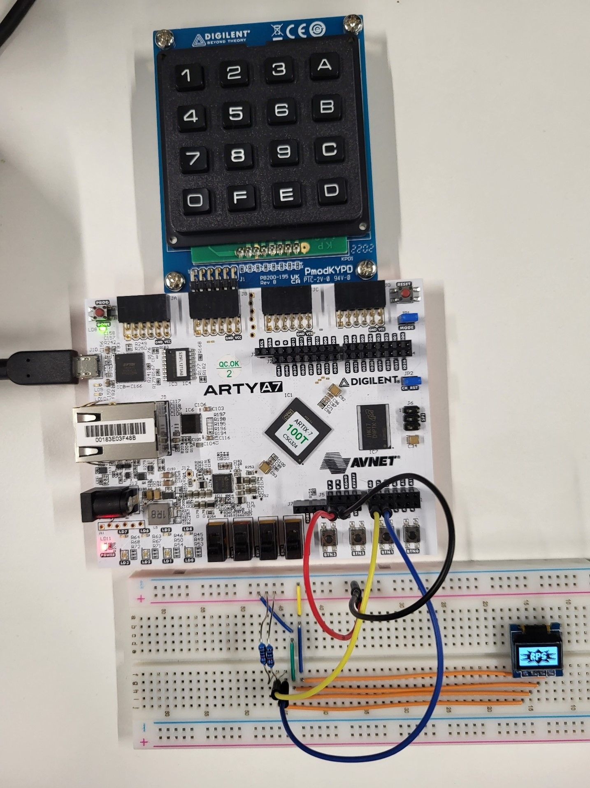

# CHIP-8 for FPGA

This is a CHIP-8 emulator made for the [Arty A7-100T](https://digilent.com/shop/arty-a7-100t-artix-7-fpga-development-board/) FPGA development board. This project was used to get more familiar with FPGAs and VHDL, so there may some mistakes here and there.

## Usage

### Prerequisites

This whole project was made using [Xilinx Vivado 2023.1](https://www.xilinx.com/products/design-tools/vivado.html), so you need to install that first.

### Load project

To load the project, start Vivado and select `Open Project` under `Quick Start`. Then you only have to select the `CHIP8-FPGA.xpr` file in the `Vivado/CHIP8-FPGA` directory. This will automatically initialise the project in Vivado.

### Generate bitstream

To generate the bitstream, you can click on the `Generate Bitstream` button under the `PROGRAM AND DEBUG` tab in the `Flow Navigator`. It will ask you to launch the synthesis and implementation first. Click `Yes` and click `OK` on the following dialog.

After the bitstream is generated, you can open your target device using the hardware manager under the `PROGRAM AND DEBUG` tab. There you can program the device using the `Program Device` button. You can select the generated `.bit` file to program the device or use one of the bitstream files in the `bitstream_files` directory if you use the Arty A7-100T development board. 

## Hardware

To build the setup, I've use the following hardware:

- [Arty A7-100T: Artix-7 FPGA Development Board](https://digilent.com/shop/arty-a7-100t-artix-7-fpga-development-board/)
- [Pmod KYPD: 16-button Keypad](https://digilent.com/shop/pmod-kypd-16-button-keypad/)
- [0.49 inch OLED Display 64*32 pixels white - I2C](https://www.tinytronics.nl/shop/en/displays/oled/0.49-inch-oled-display-64*32-pixels-white-i2c)
- 2 10K Ohm pull-up resistors for I2C

## License 

You're free to use the code in the repository according to The Unlicense license (see [`License`](LICENSE)), except the `roms` directory and `i2c_master.vhd`, `pmod_keypad.vhd` and `debounce.vhd`.
